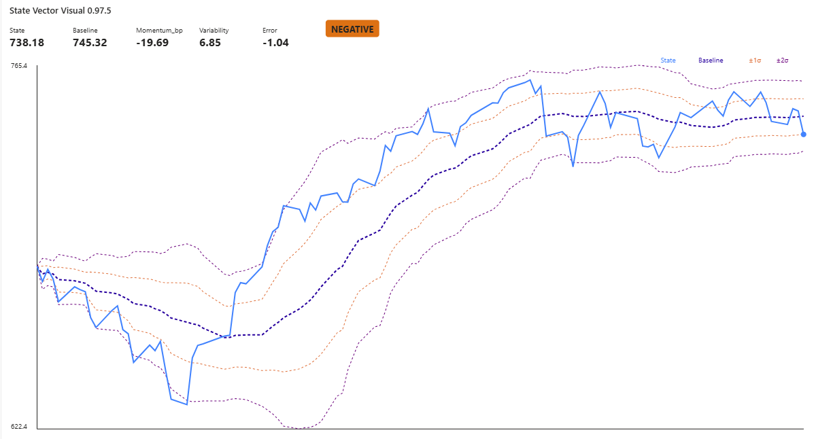

# State Vector Visual

A custom Power BI visual for converting arbitrary time-series data into a normalised State Vector representation.


## Overview

The State Vector Visual focuses on answering:

- What is the current state?
- What is normal?
- How unusual is the current state?
- Which direction is the signal moving?
- What qualitative state does that imply?

The visual transforms a time series into a compact representation suitable for:

- KPI Monitoring
- Operational Monitoring
- Compliance Monitoring
- Risk Monitoring
- Service Reliability Monitoring
- Agent-Based Decision Systems

## State Vector

The visual currently calculates:

| Component | Description |
|-----------|-------------|
| State | Most recent observed value |
| Short Baseline | Average of the short window |
| Baseline | Average of the baseline window |
| Reference | Baseline or target value |
| Momentum | Short-term trend relative to baseline |
| Variability | Rolling standard deviation |
| Error | Normalised deviation from the reference |
| Classification | Qualitative state |

## Core Equations

State

```text
State = Current Value
```

Baseline

```text
Baseline = Average(Baseline Window)
```

Momentum

```text
Momentum = (ShortBaseline - Baseline) / Baseline
```

Displayed as basis points:

```text
Momentum (bp) = Momentum × 10,000
```

Variability

```text
Variability = Rolling Standard Deviation
```

Error

```text
Error = (State - Reference) / Variability
```

Classification

```text
Error <= -2  = Large Negative
Error <= -1  = Negative

-1 < Error < 1 = Neutral

Error >= 1   = Positive
Error >= 2   = Large Positive
```

## Configuration

Window Type

The visual supports:

- Calendar Day windows
- Observation Count windows

Examples:

```text
7 / 30 / 90 days
```

or

```text
5 / 20 / 60 observations
```

Higher Is Better

```text
true
```

Examples:

- Revenue
- Availability
- Compliance

```text
false
```

Examples:

- Risk Exposure
- Vulnerability Count
- Incident Volume

Target Mode

Reference can be:

```text
Baseline
```

or

```text
Target Value
```

## Supported Use Cases

- Architecture Conformance
- Service Availability
- Customer Satisfaction
- Vulnerability Management
- Patch Compliance
- Financial Indicators
- Operational Metrics

## Design Principles

The visual is intentionally:

- Metric Agnostic
- Dimensionless
- Agent Friendly
- Statistically Stable
- Explainable

## Build

Install dependencies:

```cmd
npm install
```

Validate TypeScript:

```cmd
npx tsc --noEmit
```

Package visual:

```cmd
pbiviz package
```

Output:

```text
dist
```

## Installing the Visual in Power BI Desktop

After successfully packaging the visual, a `.pbiviz` file will be created in the `dist` folder.

### Step 1 - Build the Visual

Validate the TypeScript project:

```cmd
npx tsc --noEmit
```

Package the visual:

```cmd
pbiviz package
```

A package file will be created in:

```text
dist
```

---

### Step 2 - Open Power BI Desktop

Start Power BI Desktop and open either:

- An existing report
- A new blank report

---

### Step 3 - Import the Custom Visual

In the Visualizations pane:

1. Select the ellipsis (`...`)
2. Choose:

```text
Import a visual from a file
```

---

### Step 4 - Select the PBIVIZ File

Browse to:

```text
dist
```

Select the generated `.pbiviz` file.

Example:

```text
stateVectorVisual5F96D26098794695B26A1C6FADFD28F8.0.9.7.5.pbiviz
```

Select:

```text
Open
```

---

### Step 5 - Accept the Security Prompt

Power BI will display a custom visual import warning.

Select:

```text
Import
```

---

### Step 6 - Verify the Visual Appears

A new icon should appear in the Visualizations pane.

This is the State Vector Visual.

---

### Step 7 - Add the Visual to the Report

Select the State Vector Visual icon.

An empty visual placeholder will appear on the report canvas.

---

### Step 8 - Assign Data Fields

Drag the required fields into the visual:

```text
Timestamp → Timestamp
Value     → Value
```

The field names correspond to the roles defined in:

```json
capabilities.json
```

```json
timestamp
value
```

---

### Step 9 - Verify Calculations

The visual should display:

```text
State
Baseline
Momentum_bp
Variability
Error
Classification
```

along with the state chart.

If the visual is empty:

- Verify the Timestamp field contains valid dates
- Verify the Value field is numeric
- Verify sufficient data exists for the configured baseline window

---

### Step 10 - Updating the Visual

After making code changes:

```cmd
npx tsc --noEmit
pbiviz package
```

Generate a new package and repeat:

```text
Import a visual from a file
```

Power BI will replace the previous version with the newer build.

---

### Verifying You Imported the Correct Build

A simple technique is to temporarily change the visual title in `visual.ts`:

```ts
title.textContent = "State Vector Visual v0.98 TEST";
```

Rebuild:

```cmd
pbiviz package
```

Re-import the visual.

If the title changes, the new package has been loaded successfully.

If the title does not change, Power BI is still using an older package.


## Troubleshooting

Install Power BI Visual Tools:

```cmd
npm install -g powerbi-visuals-tools
```

Install Formatting Model support:

```cmd
npm install powerbi-visuals-utils-formattingmodel --save
```

Additional type definitions:

```cmd
npm install --save-dev @types/bcryptjs @types/dompurify @types/hast @types/istanbul-lib-coverage @types/istanbul-lib-report @types/istanbul-reports @types/jest @types/lodash @types/mdast @types/passport @types/passport-jwt @types/passport-local @types/react @types/scheduler @types/stack-utils @types/yargs @types/yargs-parser @types/d3-force @types/d3-geo
```

Resolve dependency issues:

```cmd
npm audit fix --force
```

Add to tsconfig.json if required:

```json
{
  "compilerOptions": {
    "skipLibCheck": true
  }
}
```

PowerShell workaround:

```cmd
cmd /c mklink "C:\Windows\System32\pwsh.exe" "C:\Windows\System32\WindowsPowerShell\v1.0\powershell.exe"
```

Environment setup guide:

https://learn.microsoft.com/en-us/power-bi/developer/visuals/environment-setup?tabs=desktop

## Version History

### v0.97

- State Vector model stabilised
- Observation and Day windows supported
- Theme-aware colour support
- Rolling sigma bands
- Momentum displayed in basis points
- DAX and visual calculations aligned

## Acknowledgements

This project was developed through a combination of personal research, experimentation, and extensive technical discussions with Microsoft Copilot.

The author would like to acknowledge Microsoft Copilot for assistance with:

- Power BI Custom Visual development
- TypeScript troubleshooting
- DAX validation
- Statistical modelling
- State Vector design
- Mathematical specification development
- Documentation and project structure

All design decisions, implementation choices, validation activities and final code remain the responsibility of the project author.

## License

MIT License.
