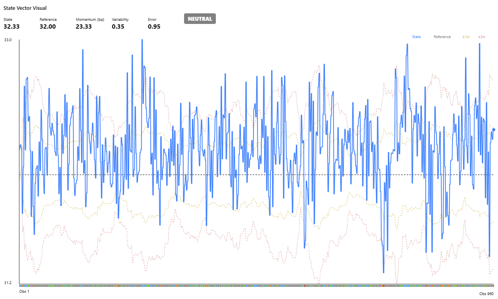

# State Vector Visual

A custom Power BI visual for converting arbitrary KPI, process-control and time-series data into a normalised State Vector representation suitable for monitoring, anomaly detection, operational awareness, SPC (statistical process control), and agent-based reasoning.



---

# Overview

The State Vector Visual focuses on answering five fundamental questions:

- What is the current state?
- What is normal?
- How unusual is the current state?
- Which direction is the signal moving?
- What qualitative state does that imply?

The visual transforms a raw signal into a compact state representation suitable for:

- KPI Monitoring
- Operational Monitoring
- Compliance Monitoring
- Risk Monitoring
- Service Reliability Monitoring
- Statistical Process Control (SPC)
- Industrial Process Monitoring
- Manufacturing Process Monitoring
- Sensor Telemetry Analysis
- Agent-Based Decision Systems

---

# State Vector

The visual calculates the following State Vector:

| Component | Description |
|-----------|-------------|
| State | Most recent observed value |
| Short Baseline | Average of the short window |
| Baseline | Average of the baseline window |
| Reference | Baseline or user-specified target |
| Momentum (bp) | Short-term trend relative to baseline, expressed in basis points |
| Variability | Rolling standard deviation |
| Error | Normalised deviation from the reference |
| Classification | Current qualitative state |
| Classification History | Historical state transition strip |

---

# Core Equations

## State

```text
State = Current Value
```

## Baseline

```text
Baseline = Average(Baseline Window)
```

## Momentum

```text
Momentum = (ShortBaseline - Baseline) / Baseline
```

Displayed as:

```text
Momentum (bp) = Momentum × 10,000
```

## Variability

```text
Variability = Rolling Standard Deviation
```

## Error

```text
Error = (State - Reference) / Variability
```

## Classification

```text
Error <= -2  = Large Negative
Error <= -1  = Negative

-1 < Error < 1 = Neutral

Error >= 1   = Positive
Error >= 2   = Large Positive
```

---

# Classification History

The visual includes a Classification History Strip beneath the chart.

Each segment represents the historical qualitative state of the signal:

```text
Large Negative
Negative
Neutral
Positive
Large Positive
```

The Classification History Strip provides context beyond the current state by showing how the signal has evolved through time.

Examples:

```text
Recovery

🟥🟧⬜🟩🟩
```

```text
Deterioration

🟩🟩⬜🟧🟥
```

```text
Sustained Positive State

🟩🟩🟩🟩🟩🟩🟩
```

This allows users to distinguish between:

- Persistent conditions
- Emerging conditions
- Recovering conditions
- Intermittent conditions

---

# Configuration

## Window Type

The visual supports two operating modes.

### Calendar Day Mode

Uses rolling windows based on elapsed time.

Examples:

```text
7 / 30 / 90 days
```

Suitable for:

- Business KPIs
- Service Metrics
- Compliance Metrics
- Risk Metrics
- Financial Indicators

### Observation Mode

Uses rolling windows based on the most recent observations.

Examples:

```text
5 / 20 / 60 observations
```

Suitable for:

- Statistical Process Control (SPC)
- Tennessee Eastman Process (TEP)
- Sensor Telemetry
- Industrial Process Monitoring
- Manufacturing Data
- Process Control Signals

When Observation Mode is enabled, the horizontal axis displays observation numbers rather than calendar dates.

Examples:

```text
Observation 1 ---------------- Observation 960
```

---

## Higher Is Better

```text
true
```

Examples:

- Revenue
- Availability
- Compliance
- Throughput
- Productivity

```text
false
```

Examples:

- Risk Exposure
- Vulnerability Count
- Incident Volume
- Defect Count
- Latency

---

## Reference Mode

Reference can be derived from:

```text
Baseline
```

or:

```text
Target Value
```

When Target Mode is enabled:

```text
Reference = Target Value
```

Error and Classification calculations are then based upon the configured Reference.

When a Target Value is used the visual automatically displays:

```text
Reference
```

instead of:

```text
Baseline
```

to ensure the basis of the calculation remains transparent.

---

# Tooltips

Metric cards include built-in contextual tooltips for:

- State
- Reference
- Momentum
- Variability
- Error
- Classification

Tooltips provide interpretation guidance and mathematical descriptions directly within the visual.

---

# Supported Use Cases

- Architecture Conformance
- Service Availability
- Customer Satisfaction
- Vulnerability Management
- Patch Compliance
- Financial Indicators
- Operational Metrics
- Statistical Process Control (SPC)
- Industrial Process Monitoring
- Tennessee Eastman Process (TEP)
- Manufacturing Process Control
- Sensor Monitoring
- Machine Telemetry
- Reliability Engineering

---

# Design Principles

The visual is intentionally:

- Metric Agnostic
- Dimensionless
- Agent Friendly
- Statistically Stable
- Explainable
- Process Control Friendly
- KPI Agnostic
- Suitable 

---

# Build

Install dependencies:

```cmd
npm install
```

Validate TypeScript:

```cmd
npx tsc --noEmit
```

Package visual:

```cmd
pbiviz package
```

Output:

```text
dist
```

---

# Installing the Visual in Power BI Desktop

After successfully packaging the visual, a `.pbiviz` file will be created in the `dist` folder.

## Step 1 - Build the Visual

```cmd
npx tsc --noEmit
pbiviz package
```

## Step 2 - Open Power BI Desktop

Open either:

- A new report
- An existing report

## Step 3 - Import the Visual

Select:

```text
...
```

then:

```text
Import a visual from a file
```

## Step 4 - Select the PBIVIZ File

Browse to:

```text
dist
```

and select the generated `.pbiviz` package e.g. stateVectorVisual5F96D26098794695B26A1C6FADFD28F8.1.0.0.7.pbiviz

## Step 5 - Accept the Security Prompt

Select:

```text
Import
```

## Step 6 - Verify the Visual Appears

A new icon should appear in the Visualizations pane.

## Step 7 - Add the Visual

Select the visual icon and place it on the report canvas.

## Step 8 - Assign Data Fields

Drag fields into the visual:

```text
Time / Observation → Time / Observation

Value → Value
```

The Time / Observation field may contain:

- Calendar Dates
- Timestamps
- Observation Numbers
- Sample Numbers
- Process Control Indices

## Step 9 - Verify Calculations

The visual should display:

```text
State
Reference / Baseline
Momentum (bp)
Variability
Error
Classification
```

along with:

```text
Classification History Strip
Sigma Envelopes
State Signal
```

## Step 10 - Updating the Visual

After making changes:

```cmd
npx tsc --noEmit
pbiviz package
```

Re-import the generated package into Power BI.

---

# Troubleshooting

Install Power BI Visual Tools:

```cmd
npm install -g powerbi-visuals-tools
```

Install Formatting Model support:

```cmd
npm install powerbi-visuals-utils-formattingmodel --save
```

Additional type definitions:
```
npm install --save-dev @types/bcryptjs @types/dompurify @types/hast @types/istanbul-lib-coverage @types/istanbul-lib-report @types/istanbul-reports @types/jest @types/lodash @types/mdast @types/passport @types/passport-jwt @types/passport-local @types/react @types/scheduler @types/stack-utils @types/yargs @types/yargs-parser @types/d3-force @types/d3-geo
```

Resolve dependency issues:

```cmd
npm audit fix --force
```

Add to `tsconfig.json` if required:

```json
{
  "compilerOptions": {
    "skipLibCheck": true
  }
}
```

PowerShell workaround:

```cmd
cmd /c mklink "C:\Windows\System32\pwsh.exe" "C:\Windows\System32\WindowsPowerShell\v1.0\powershell.exe"
```

Environment setup guide:

[Power BI Custom Visual Environment Setup](https://learn.microsoft.com/en-us/power-bi/developer/visuals/environment-setup?tabs=desktop)

---

# Version History

## v1.0.0.7

- Reference Mode
- Target Value Support
- Observation Mode
- Calendar Day Mode
- Configurable Windows
- Configurable Colours
- Configurable Behaviour
- Classification History Strip
- Metric Tooltips
- X-Axis Labels
- Theme-Aware Rendering
- Momentum Displayed in Basis Points
- Reference-Based Error Calculation
- SPC Validation
- Tennessee Eastman Process Validation

## v0.97

- Initial State Vector implementation
- Rolling baseline calculations
- Variability modelling
- Rolling sigma envelopes
- DAX alignment

---

# Test Data Acknowledgements

Examples and validation screenshots within this repository make use of the Tennessee Eastman Process (TEP) simulation dataset:

Rieth, Cory A.; Amsel, Ben D.; Tran, Randy; Cook, Maia B. (2017)

> Additional Tennessee Eastman Process Simulation Data for Anomaly Detection Evaluation

Harvard Dataverse, Version 1

DOI:

https://doi.org/10.7910/DVN/6C3JR1

The Tennessee Eastman Process is one of the most widely used benchmark datasets for:

- Process Control
- Fault Detection
- Anomaly Detection
- Industrial Process Monitoring
- Process Systems Engineering Research

The author gratefully acknowledges the creators of the dataset and Harvard Dataverse for making this resource publicly available.

---

# Acknowledgements

This project was developed through a combination of personal research, experimentation, and extensive technical discussions with Microsoft Copilot.

The author would like to acknowledge Microsoft Copilot for assistance with:

- Power BI Custom Visual Development
- TypeScript Troubleshooting
- DAX Validation
- Statistical Modelling
- State Vector Architecture
- Mathematical Specification Development
- Documentation and Project Structure

All design decisions, implementation choices, validation activities and final code remain the responsibility of the project author.

---

# License

MIT License.
